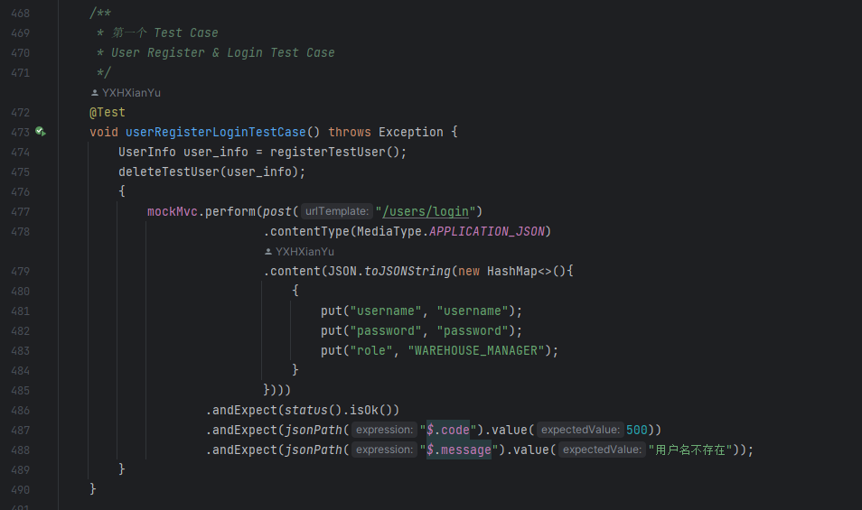
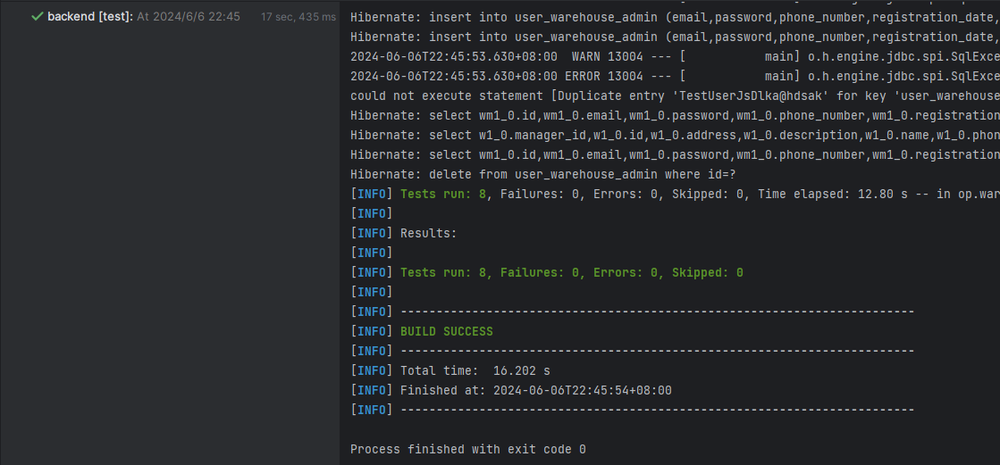
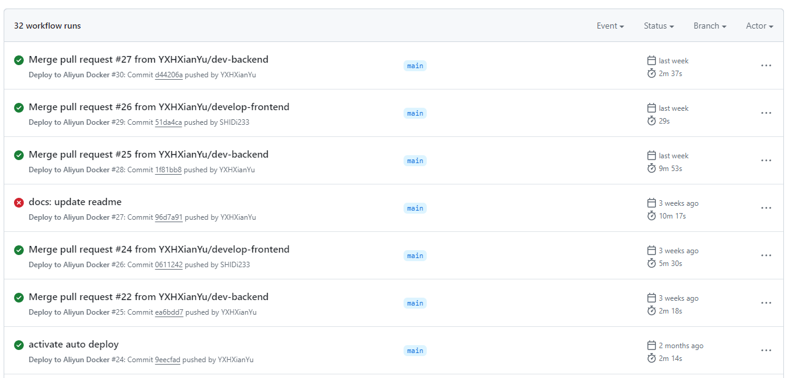
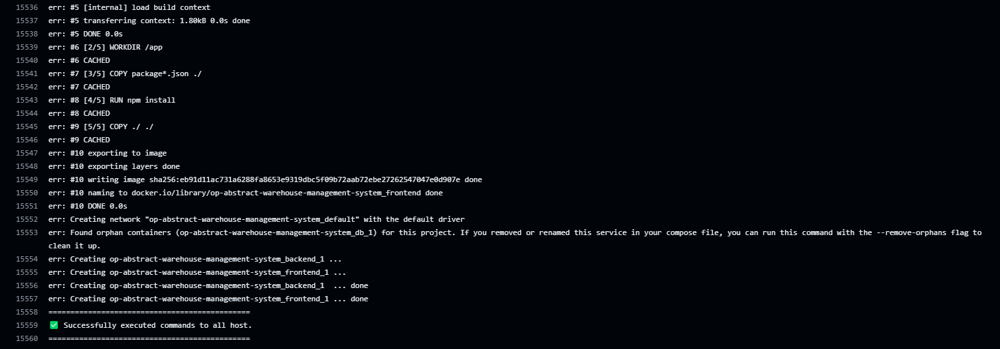
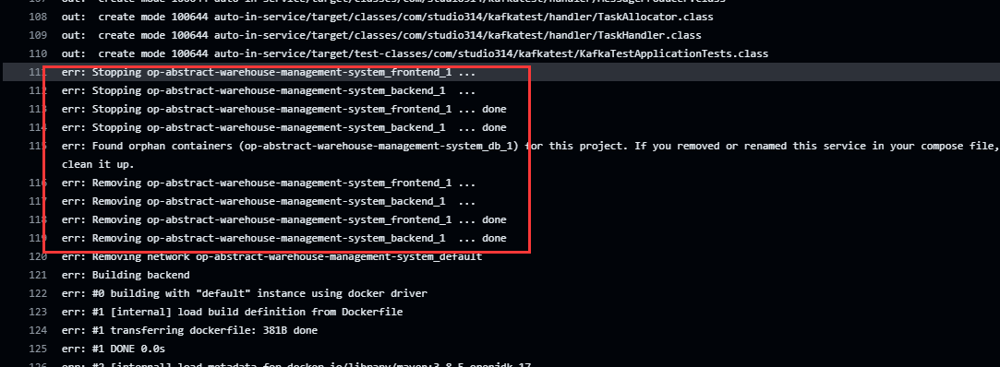
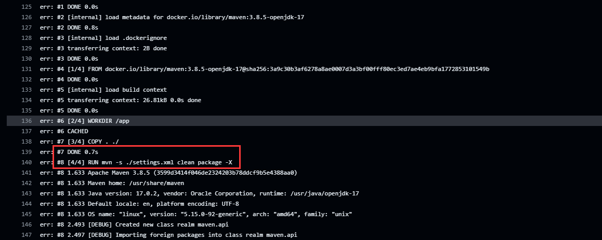
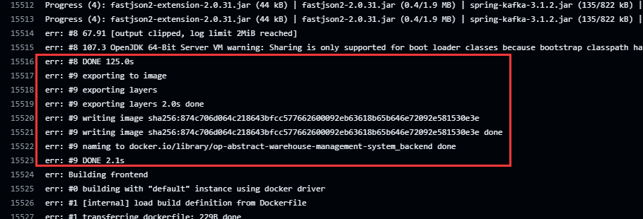
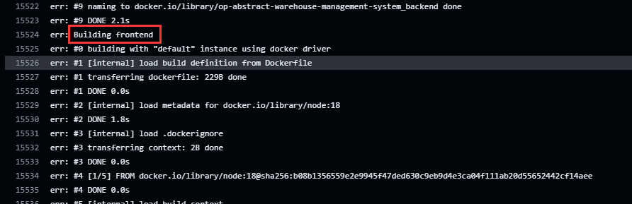
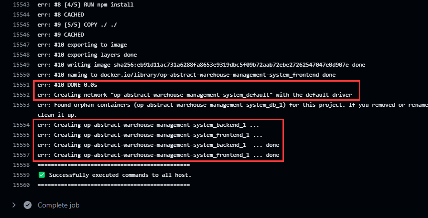

# CI-CD README

## 1. 简介

* 本项目是一个基于Spring Boot的仓库管理系统，实现了用户注册、登录、货物分类、货物管理、出入库单管理等功能。
* 本文档是CI/CD实验的README文档，主要介绍了CI/CD的实现过程。
* 本文档共分为以下这几个部分
  * 手动部署说明（同README）
  * CI/CD工作流
  * 执行结果

## 2. 本项目部署说明

* 手动部署教程（不使用自动化部署，同README对应部分）

* Docker version: `>= 25.0.2`

* Please configure your **Docker Source** before deployment!
  * you can configure it through `/etc/docker/daemon.json` in Linux.

* Deploy
  ```
  git clone git@github.com:YXHXianYu/OP-Abstract-Warehouse-Management-System.git
  cd OP-Abstract-Warehouse-Management-System
  docker-compose up
  ```

* Rebuild without cache
  ```
  docker-compose build --no-cache
  docker-compose up
  ```

## 3. CI/CD工作流

* 本项目使用以下技术实现CI/CD
  * 后端构建：Maven
  * 前端构建：npm
  * 自动化部署：Github Actions
  * 化简构建流程：Docker
  * 自动化测试：JUnit

* 流程概述

  * 编写测试用例

  * 配置 Github Actions

  * 配置 Docker

* 流程

  * Test Case
    * 在后端代码中编写测试用例，使用JUnit框架进行测试
  * Github Actions

    * 当代码提交到Github仓库的main分支时，Github Actions会自动触发CI/CD流程
    * Github Actions配置了云服务器的SSH密钥，可以自动登录到云服务器
    * Github Actions登陆腾讯云服务器，执行Docker构建与部署
    * Github Actions deploy.yml脚本代码

    ```yml
    name: Deploy to Aliyun Docker
    
    on:
      push:
        branches:
          - main
    
    jobs:
      deploy:
        runs-on: ubuntu-22.04
        steps:
        - name: Setup SSH connection
          uses: appleboy/ssh-action@master
          with:
            host: ${{ secrets.ALIYUN_SERVER_IP }}
            username: ${{ secrets.ALIYUN_SERVER_USERNAME }}
            key: ${{ secrets.ALIYUN_SERVER_SSH_PRIVATE_KEY }}
            script: |
              cd ~/OP-Abstract-Warehouse-Management-System
              git pull origin main
              docker-compose down
              docker-compose build
              docker-compose up -d
    ```
  * Docker
    * Docker根据docker-compose.yml文件，分别构建前端与后端的Docker镜像
    * 前端和后端分别根据对应的Dockerfile文件构建Docker镜像
    * 待前后端Docker镜像构建完成后，Docker根据docker-compose.yml文件启动容器
    * docker-compose.yml文件
    ```yml
    version: '3.8'
    services:
      backend:
        build: ./backend
        ports:
          - "8080:8080"
        environment:
          - SPRING_DATASOURCE_URL=jdbc:mysql://121.40.90.193:3306/prod_database
          - SPRING_DATASOURCE_USERNAME=root
          - SPRING_DATASOURCE_PASSWORD=MySQL_2024JACKY
    
      frontend:
        build: ./frontend
        ports:
          - "5173:5173"
    ```

    * Backend Dockerfile
    ```Dockerfile
    # 使用 OpenJDK 为基础镜像
    FROM maven:3.8.5-openjdk-17
    
    # 设置工作目录
    WORKDIR /app
    
    # 将 Maven 项目复制到容器中
    COPY . ./
    
    # 使用 Maven 构建应用
    RUN mvn -s ./settings.xml clean package -X
    
    # 指定运行时的端口
    EXPOSE 8080
    
    # 运行 SpringBoot 应用
    CMD ["java", "-jar", "target/backend-0.0.1-SNAPSHOT.jar"]
    ```

    * Frontend Dockerfile
    ```Dockerfile
    # 构建阶段
    FROM node:18
    
    WORKDIR /app
    
    # 安装依赖
    COPY package*.json ./
    RUN npm install
    
    # 构建应用
    COPY ./ ./
    
    # 指定运行时的端口
    EXPOSE 5173
    
    CMD ["npm", "run", "dev"]
    ```

## 4. 执行效果

### 4.1 测试用例

* 测试用例部分代码
  * 
* 测试用例结果
  * 

### 4.2 Github Actions

* 部署代码见上文或此链接：https://github.com/YXHXianYu/OP-Abstract-Warehouse-Management-System/blob/main/.github/workflows/deploy.yml
* 部分部署历史记录
  * 链接：https://github.com/YXHXianYu/OP-Abstract-Warehouse-Management-System/actions
  * 注：本文档完成后，其他小组成员会对项目进行修改，所以本文档的截图并非提交时最新的部署结果。
  * 
* `Merge pull request #27 from YXHXianYu/dev-backend`的部分详细信息
  * 链接：https://github.com/YXHXianYu/OP-Abstract-Warehouse-Management-System/actions/runs/9263900374/job/25483099559
  * 

### 4.3 Docker

* 代码见上文，或如下链接
  * docker-compose.yml：https://github.com/YXHXianYu/OP-Abstract-Warehouse-Management-System/blob/main/docker-compose.yml
  * 后端dockerfile：https://github.com/YXHXianYu/OP-Abstract-Warehouse-Management-System/blob/main/backend/Dockerfile
  * 前端dockerfile：https://github.com/YXHXianYu/OP-Abstract-Warehouse-Management-System/blob/main/frontend/Dockerfile
* 参考链接：https://github.com/YXHXianYu/OP-Abstract-Warehouse-Management-System/actions/runs/9263900374/job/25483099559
* 重置容器信息
  * 
* 后端部署
  * 
* 后端部署完成
  * 
* 前端部署
  * 
* 前端部署完成
  * 
